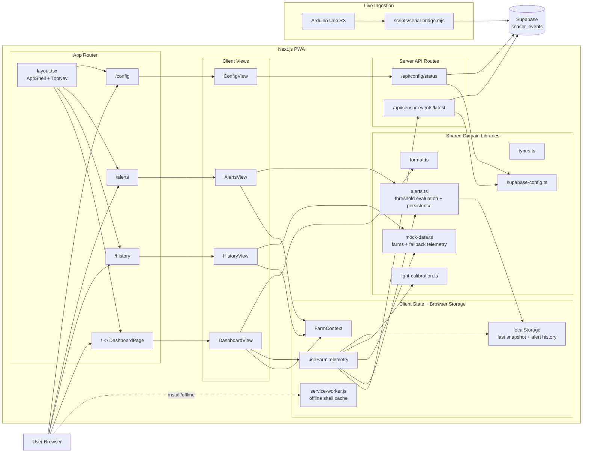
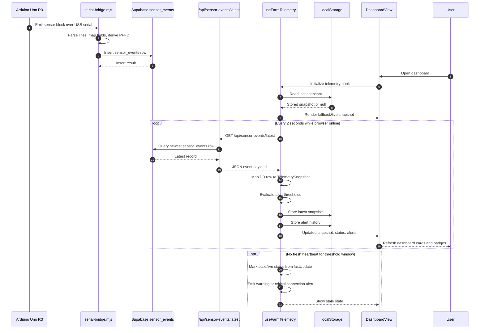

# VerdantOS UML

Mermaid diagrams below match current code shape in this repo.

## Component UML

```mermaid
flowchart LR
    User[User Browser]

    subgraph PWA[Next.js PWA]
        direction TB

        subgraph AppRouter[App Router]
            Layout["layout.tsx\nAppShell + TopNav"]
            DashboardPage["/ -> DashboardPage"]
            HistoryPage["/history"]
            AlertsPage["/alerts"]
            ConfigPage["/config"]
        end

        subgraph Views[Client Views]
            DashboardView["DashboardView"]
            HistoryView["HistoryView"]
            AlertsView["AlertsView"]
            ConfigView["ConfigView"]
        end

        subgraph ClientState[Client State + Browser Storage]
            FarmContext["FarmContext"]
            TelemetryHook["useFarmTelemetry"]
            LocalStorage["localStorage\nlast snapshot + alert history"]
            ServiceWorker["service-worker.js\noffline shell cache"]
        end

        subgraph DomainLib[Shared Domain Libraries]
            MockData["mock-data.ts\nfarms + fallback telemetry"]
            AlertsLib["alerts.ts\nthreshold evaluation + persistence"]
            LightCal["light-calibration.ts"]
            FormatLib["format.ts"]
            Types["types.ts"]
            SupabaseConfig["supabase-config.ts"]
        end

        subgraph ApiRoutes[Server API Routes]
            LatestRoute["/api/sensor-events/latest"]
            StatusRoute["/api/config/status"]
        end
    end

    subgraph Ingestion[Live Ingestion]
        Arduino["Arduino Uno R3"]
        Bridge["scripts/serial-bridge.mjs"]
    end

    DB[(Supabase\nsensor_events)]

    User --> DashboardPage
    User --> HistoryPage
    User --> AlertsPage
    User --> ConfigPage

    Layout --> DashboardPage
    Layout --> HistoryPage
    Layout --> AlertsPage
    Layout --> ConfigPage

    DashboardPage --> DashboardView
    HistoryPage --> HistoryView
    AlertsPage --> AlertsView
    ConfigPage --> ConfigView

    DashboardView --> FarmContext
    DashboardView --> TelemetryHook
    DashboardView --> FormatLib
    HistoryView --> FarmContext
    HistoryView --> MockData
    AlertsView --> FarmContext
    AlertsView --> AlertsLib
    ConfigView --> StatusRoute

    TelemetryHook --> LatestRoute
    TelemetryHook --> AlertsLib
    TelemetryHook --> MockData
    TelemetryHook --> LightCal
    TelemetryHook --> LocalStorage

    AlertsLib --> LocalStorage

    LatestRoute --> SupabaseConfig
    StatusRoute --> SupabaseConfig
    LatestRoute --> DB
    StatusRoute --> DB

    Arduino --> Bridge
    Bridge --> DB

    User -. install/offline .-> ServiceWorker
```

## Sequence UML

```mermaid
sequenceDiagram
    autonumber
    participant A as Arduino Uno R3
    participant B as serial-bridge.mjs
    participant D as Supabase sensor_events
    participant R as /api/sensor-events/latest
    participant H as useFarmTelemetry
    participant L as localStorage
    participant V as DashboardView
    participant U as User

    A->>B: Emit sensor block over USB serial
    B->>B: Parse lines, map fields, derive PPFD
    B->>D: Insert sensor_events row
    D-->>B: Insert result

    U->>V: Open dashboard
    V->>H: Initialize telemetry hook
    H->>L: Read last snapshot
    L-->>H: Stored snapshot or null
    H-->>V: Render fallback/live snapshot

    loop Every 2 seconds while browser online
        H->>R: GET /api/sensor-events/latest
        R->>D: Query newest sensor_events row
        D-->>R: Latest record
        R-->>H: JSON event payload
        H->>H: Map DB row to TelemetrySnapshot
        H->>H: Evaluate alert thresholds
        H->>L: Store latest snapshot
        H->>L: Store alert history
        H-->>V: Updated snapshot, status, alerts
        V-->>U: Refresh dashboard cards and badges
    end

    opt No fresh heartbeat for threshold window
        H->>H: Mark stale/live status from lastUpdate
        H->>H: Emit warning or critical connection alert
        H-->>V: Show stale state
    end
```
